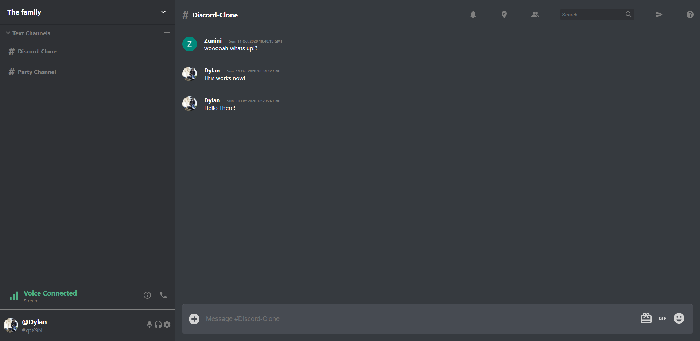

# Discord Clone

## Info

This project has been built from the create-react-app --template redux app. 
It uses Google Firebase to host the backend and that is how the Sign In and 
Channel data is being used. The Discord clone has the basic messaging functionality
that the real Discord has, as well as being able to create additional channels.

You can view a hosted version of the site at https://discord-clone-6e4b5.web.app/

## Available Scripts

In the project directory, you can run:

### `npm start`

Runs the app in the development mode. 
Open [http://localhost:3000](http://localhost:3000) to view it in the browser.

The page will reload if you make edits. 
You will also see any lint errors in the console.

## Example Image

